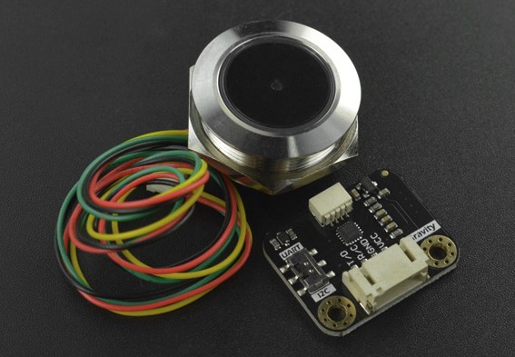
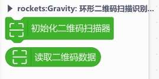
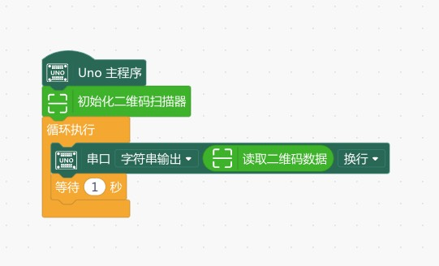

# I2C OLED-2864 screen




---------------------------------------------------------

## Table of Contents

* [URL](#url)
* [Summary](#summary)
* [Blocks](#blocks)
* [License](#license)
* [Supported targets](#Supportedtargets)

## URL
* Project URL : ```https://github.com/DFRobot/ext-oled12864```

* Tutorial URL : ```https://mindplus.dfrobot.com.cn/extensions-user```

* Get a purchase connection: [store](https://www.dfrobot.com/).

## Summary
Support different drawings in the screen, including point, line, circle, rectangle, triangle,rounded rectangle and some commands.
Support English characters and character library chips of DFRobot modules.
IIC: the redraw rate is more than 30 frames per second when redrawed by ESP series controllers

## Blocks




## Examples



## License

MIT

## Supported targets

MCU                | JavaScript    | Arduino   | MicroPython    | Remarks
------------------ | :----------: | :----------: | :---------: | -----
micro:bit        |             |       √       |             | 
mpython        |             |        √      |             | 


## Release Logs
* V0.0.1  Basic functions completed.
* V0.0.2  Revised according to V1.6.2 RC2.0
* V0.0.3  add version and menus file